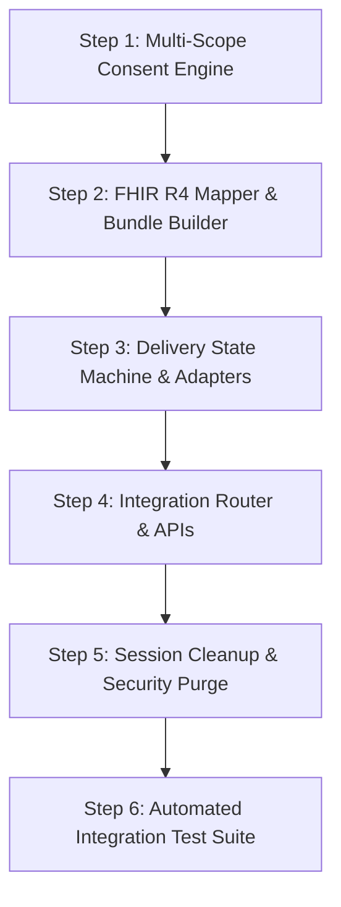

# Phase 9 — Working Implementation Plan
## Consent, FHIR R4, ABDM & HIS Integration

> **Target Module:** Module D (Consent + Integration)  
> **Source Baseline:** `PHASES.md` lines 103–111 & `ABDM_FHIR_SPEC.md`  
> **Backend Stack:** FastAPI / Python 3.10 / Pydantic v2 / pytest  

---

## 🎯 Direct Requirements & Architecture Mapping

| Requirement from `PHASES.md` | Concrete Technical Implementation | Target File(s) |
|---|---|---|
| **1. Granular, revocable, audio-guided consent** | Upgrade `ConsentContext` to support 4 independent scopes (`INTAKE`, `DOCUMENTS`, `SUMMARY`, `HIS_SHARE`) with grant/revoke APIs and TTS audio prompt scripts. | `backend/app/models/consent.py` `backend/app/services/consent_engine.py` `backend/app/api/endpoints/consent_router.py` |
| **2. Approved ABHA/new-registration boundary** | Connect existing ABDM M1 sandbox OTP endpoints (`/abha/initiate`, `/abha/confirm`) to automatically link identity into `PatientDataObject.identity`. | `backend/app/api/endpoints/sessions.py` `backend/app/models/abha.py` |
| **3. Validated FHIR R4 Bundle & Mock Adapter** | Build `Composition`-first FHIR R4 document Bundle from `PatientDataObject` with referential integrity validator and `MockDeliveryAdapter`. | `backend/app/services/fhir/resource_mapper.py` `backend/app/services/fhir/bundle_builder.py` `backend/app/services/fhir/validator.py` |
| **4. ABDM/HIS Sandbox (Credential Gated)** | Feature-flagged `ABDMSandboxAdapter` & `HISAdapter` that run when `.env` credentials exist, falling back to `MockDeliveryAdapter` otherwise. | `backend/app/services/delivery/abdm_sandbox_adapter.py` `backend/app/services/delivery/his_adapter.py` |
| **5. Truthful Delivery State & Session Cleanup** | Implement state machine (`PREPARED` → `QUEUED` → `ACCEPTED` / `REJECTED` / `FAILED`). Purge session on `ACCEPTED`; retain minimal encrypted state on `FAILED`. | `backend/app/models/delivery.py` `backend/app/services/delivery/delivery_service.py` `backend/app/api/endpoints/integration_router.py` |

---

## 🛠️ Step-by-Step Implementation Roadmap

---

### Step 1: Multi-Scope Granular Consent Engine

#### 1.1 Update Model (`backend/app/models/consent.py`)
Replace single-scope storage with a multi-scope map so each scope is tracked independently:
* **Scopes:** `INTAKE`, `DOCUMENTS`, `SUMMARY`, `HIS_SHARE`
* **Per-Scope Fields:** `status` (`GRANTED`, `REVOKED`, `PENDING`), `granted_at`, `revoked_at`, `interaction_mode` (`TOUCH_SCREEN`, `VOICE_CONFIRMED`), `evidence_reference`, `policy_version`.

#### 1.2 Consent Engine Service (`backend/app/services/consent_engine.py`)
* `check_consent(session, scope) -> bool`: Checks if specified scope is `GRANTED`.
* `enforce_consent(session, scope)`: Raises `HTTP 403 CONSENT_REQUIRED` if missing.
* `get_audio_consent_script(scope, language) -> str`: Generates localized audio script text for TTS voice guidance across 6 Indian languages.

#### 1.3 Refactor Consent Router (`backend/app/api/endpoints/consent_router.py`)
* `GET /sessions/{id}/consent` → Returns status for all 4 scopes.
* `POST /sessions/{id}/consent` → Grants specific scope.
* `POST /sessions/{id}/consent/revoke` → Revokes specific scope.
* `GET /sessions/{id}/consent/audio-script` → Fetches TTS guidance script.

---

### Step 2: FHIR R4 Mapping & Composition Bundle Builder

#### 2.1 Pydantic FHIR Models (`backend/app/services/fhir/fhir_types.py`)
Implement strict FHIR R4 structures for `Patient`, `Encounter`, `Condition`, `Observation`, `MedicationStatement`, `DocumentReference`, `Consent`, `Composition`, and `Bundle`.

#### 2.2 Resource Mapper (`backend/app/services/fhir/resource_mapper.py`)
* `map_patient(identity) -> FHIR Patient`
* `map_encounter(session_id, facility_id) -> FHIR Encounter`
* `map_observations(answered_questions) -> List[FHIR Observation]`
* `map_conditions(chief_complaint, red_flags) -> List[FHIR Condition]`
* `map_documents(staged_docs) -> List[FHIR DocumentReference]`
* `map_consent(consent_context) -> FHIR Consent`

#### 2.3 Document Bundle Builder (`backend/app/services/fhir/bundle_builder.py`)
Per ABDM specification (Chapter 33 Envelope Protocol):
* First resource in bundle (`entry[0]`) **MUST** be `Composition` (Type: `OPConsultation`, SNOMED: `371530004`).
* Composition sections reference all sub-resources (`subject`, `encounter`, `conditions`, `observations`, `documents`).
* Whole payload wrapped as `Bundle` (type: `document`).

#### 2.4 Referential Integrity Validator (`backend/app/services/fhir/validator.py`)
* Verifies all `resource.id` and `reference` URIs (e.g. `Patient/PAT_101`) resolve inside the same Bundle.
* Validates mandatory FHIR R4 fields.

---

### Step 3: Delivery Adapters & State Machine

#### 3.1 Delivery Models (`backend/app/models/delivery.py`)
* `DeliveryState` Enum: `PREPARED`, `QUEUED`, `ACCEPTED`, `REJECTED`, `FAILED`.
* `DeliveryRecord`: Tracks `delivery_id`, `session_id`, `state`, `target` (`MOCK`, `ABDM_SANDBOX`, `HIS`), `fhir_bundle_hash`, `timestamp`, `is_mock` flag.

#### 3.2 Delivery Adapters (`backend/app/services/delivery/`)
* `base_adapter.py`: Abstract interface (`submit()`, `check_status()`).
* `mock_adapter.py`: `MockDeliveryAdapter` — Simulates instant/async handoff, returning `is_mock=True` to maintain truthfulness.
* `abdm_sandbox_adapter.py`: `ABDMSandboxAdapter` — Active only when `ABDM_SANDBOX_CLIENT_ID` is set in `.env`.
* `his_adapter.py`: `HISAdapter` — Active only when `HIS_TARGET_URL` is set in `.env`.

---

### Step 4: Delivery Orchestrator & Integration Router

#### 4.1 Delivery Service (`backend/app/services/delivery/delivery_service.py`)
* Enforces `HIS_SHARE` consent check.
* Enforces clinician-approved summary requirement (`draft_status in ['ACCEPTED', 'AMENDED']`).
* Generates FHIR R4 Bundle → Validates Bundle → Executes selected Adapter.

#### 4.2 Integration API Endpoints (`backend/app/api/endpoints/integration_router.py`)
* `POST /api/v1/sessions/{id}/integration/prepare` → Builds & returns validated FHIR Bundle (`PREPARED`).
* `POST /api/v1/sessions/{id}/integration/submit` → Submits bundle to target adapter (`QUEUED` → `ACCEPTED`/`REJECTED`/`FAILED`).
* `GET /api/v1/sessions/{id}/integration/status` → Queries delivery state.

---

### Step 5: Truthful Delivery State & Session Lifecycle Cleanup

#### 5.1 Post-Submission Lifecycle (`backend/app/services/delivery/delivery_service.py`)
* **Upon `ACCEPTED` (Success):**
  - Purge ephemeral session history and staged binary documents from memory/storage (`session_repo.delete_session()`).
  - Retain only non-PHI audit record (`DeliveryRecord` + consent reference).
* **Upon `FAILED` / `QUEUED` (Recoverable Error):**
  - Strip raw clinical text & documents.
  - Retain minimal encrypted resumable identity & consent metadata for retry.

---

### Step 6: Verification & Automated Test Suite

#### Automated Test Suite (`backend/tests/test_phase9_integration.py`)
Create 12 automated pytest tests covering:
1. Granular consent grant/revoke per scope.
2. Consent gate preventing delivery when `HIS_SHARE` is missing.
3. FHIR R4 Bundle creation with `Composition` as `entry[0]`.
4. Referential integrity of generated FHIR Bundle.
5. Mock delivery lifecycle (`PREPARED` → `QUEUED` → `ACCEPTED`).
6. Truthful delivery reporting (`is_mock=True`).
7. Session data purge upon confirmed `ACCEPTED` delivery.
8. Minimal state retention on recoverable `FAILED` delivery.

---

## 🏁 Exit Criteria Verification Plan

| Exit Condition | Verification Method |
|---|---|
| Consented hand-off | Verified via `test_consent_enforcement_gate` (HTTP 403 on missing consent) |
| Validated FHIR R4 payload | Verified via `test_fhir_referential_integrity` & schema check |
| Truthful status reporting | Verified via `DeliveryRecord.is_mock == True` on mock runs |
| Session data cleanup | Verified via `session_repo.get_session()` returning `None` post-accepted delivery |
| Automated suite passing | 12/12 Phase 9 tests passing (Total backend tests: 35/35) |

---

## 🚀 Execution Readiness

Shall we begin by implementing **Step 1: Multi-Scope Consent Engine** (`backend/app/models/consent.py` & `consent_router.py`)?
